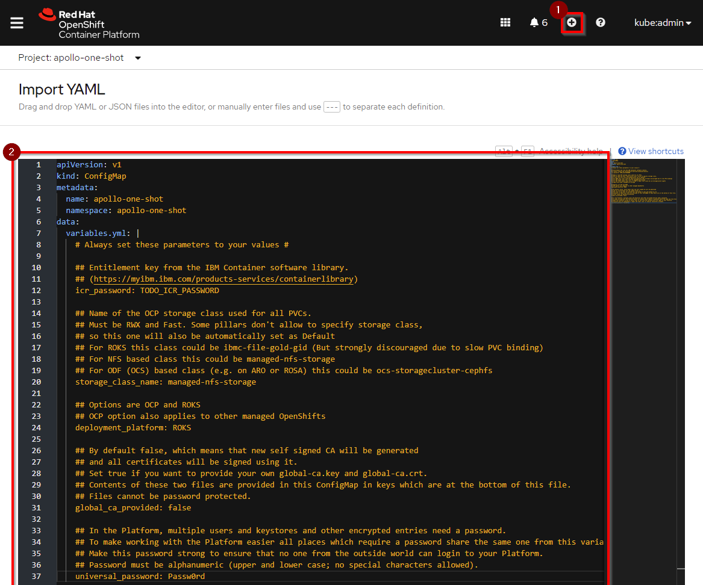
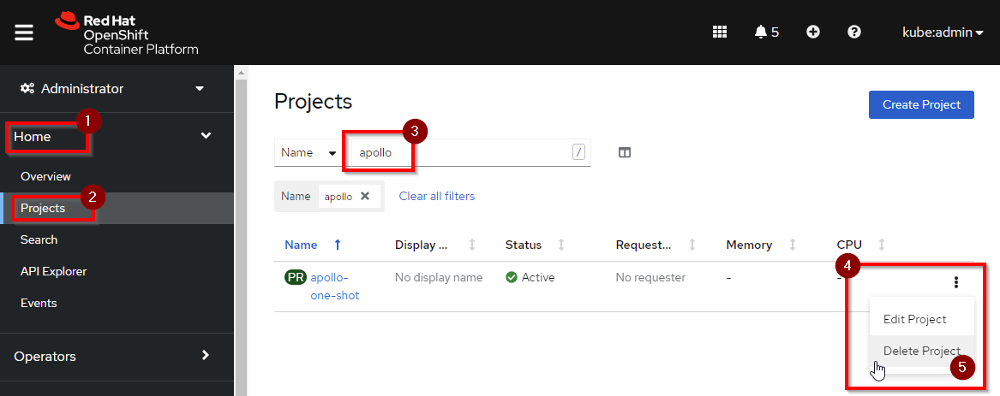

# Installation of Cloud Pak for Business Automation on containers - One-shot enterprise deployment 🔫

Goal of this repository is to almost automagically install CP4BA Enterprise patterns with all kinds of prerequisites and collateral. 

Last installation was performed on 2021-09-02 with CP4BA version 21.0.2-IF002 (also called 21.0.2.2 or 21.2.2)

Deploying CP4BA is based on official documentation which is located at https://www.ibm.com/docs/en/cloud-paks/cp-biz-automation/21.0.x?topic=kubernetes-installing-enterprise-deployments.  
Deployment of other parts is also based on respective official documentations.

## Disclaimer ✋

This is **not** an official IBM documentation.  
Absolutely no warranties, no support, no responsibility for anything.  
Use it on your own risk and always follow the official IBM documentations.

Please do not hesitate to create an issue here if needed. Your feedback is appreciated.

Not for production use. Suitable for Demo and PoC environments - but with enterprise deployment.  

## Benefits 🚀

- Automatic deployment of the whole platform where you don't need to take care about almost any prerequisites
- Common Global CA used to sign all certificates so there is only one certificate you need to trust in you local machine to trust all URLs of the whole platform
- Trusted certificate in browser also enable you to save passwords
- Wherever possible a common admin user *cpadmin* with simple password is used so you don't need to remember credentials when you want to access the platform (convenience also comes with responsibility - so you don't want to expose your platform to whole world)
- The whole platform is running on containers so you don't need to manually prepare anything on traditional VMs and take care of it including required prerequisites
- Many otherwise manual post-deployment steps have been automated
- Pre integrated and automatically connected extras are deployed in the platform for easier access/management/troubleshooting
- You have a working starting Enterprise deployment which you can use as a reference for further custom deployments

## General Information 📢

Result of this Enterprise deployment is not fully supported:
- for convenience, it contains OpenLDAP as a directory provider which is not supported - in real deployments this needs to be replaced with a supported directory provider
- for convenience and lower resource consumption, it uses one containerized DB2 database and schemas for majority of required DBs - in real deployments a supported DB option described on [Compatibility matrix](https://www.ibm.com/software/reports/compatibility/clarity-reports/report/html/softwareReqsForProduct?deliverableId=F883F7E084D911EB986DCF4EEFB38D3F&osPlatforms=Linux|Mac%20OS|Windows&duComponentIds=D010|D009|D011|S013|S012|S002|S003|C020|C025|C014|C029|C018|C022|C026|C017|C028|C023|C021|C027|C019|C024|C015|C016|C001&mandatoryCapIds=71|26&optionalCapIds=134|62|127|9|401|132|20|161) > Supported Software > Databases would be used

What is not included:
- IER - cannot use UMS, missing IER object stores and configuration.
- ICCs - cannot use UMS, not covered.
- BAW/BAI Workforce Insights, unresolved issues.
- Caution! FNCM External share - login issues, do not configure, otherwise other capabilities will break as well - waiting for fixes here.
- Workflow Server and Workstream Services - this is a dev deployment. BAW Authoring and (BAW + IAWS) are mutually exclusive in single project.

Keep in mind that the platform contains DB2 which is licensed with Standard Edition license available from CP4BA and it must adhere to the *Additional IBM DB2 Standard Edition Detail* in official license information at http://www-03.ibm.com/software/sla/sladb.nsf/doclookup/F2925E0D5C24EAB4852586FE0060B3CC?OpenDocument

## Environments used for installation 💻

- ROKS - RedHat OpenShift Kubernetes Service allowing to run managed Red Hat OpenShift on IBM Cloud  
OpenShift 4.7.x - 5 Worker Nodes (16 CPU, 32GB Memory)

- Traditional OpenShift cluster created from scratch on top of virtualization platform  
OpenShift 4.7.x on vms - 6 Worker Nodes (16 CPU, 32GB Memory)

## What is in the package 📦

When you perform full deployment, as a result you will get full CP4BA platform as seen in the picture.

More details about each section from the picture follows.

### Extras section

Contains extra software which makes working with the platform even easier.

- DB2MC - web UI for DB2 database making it easier to admin and troubleshoot the DB  
- phpLDAPadmin - web UI for OpenLDAP directory making it easier to admin and troubleshoot the LDAP  
- Gitea - contains Git server with web UI and is used for ADS and ADP for project sharing and publishing. Organizations for ADS and APD are automatically created. Gitea is connected to OpenLDAP for authentication and authorization
- Nexus - repository manager which contains pushed ADS java libraries needed for custom development and also for publishing custom ADS jars. Nexus is connected to OpenLDAP for authentication and authorization
- Roundcube - web UI for included Mail server to be able to see incoming emails  
- Cerebro - web UI elastic search browser automatically connected to ES instance deployed with CP4BA  
- AKHQ - web UI kafka browser automatically connected to Kafka instance deployed with CP4BA  
- Kibana - Web UI elastic search dashboarding tool automatically connected to ES instance deployed with CP4BA  
- Mail server - for various mail integrations e.g. from BAN or BAW  
  
### CP4BA (Cloud Pak for Business Automation) section

#### CP4BA capabilities

Purple color is used for CP4BA capabilities.

More info for these capabilities is available in official docs at https://www.ibm.com/docs/en/cloud-paks/cp-biz-automation/21.0.x.
More specifically in overview of patterns at https://www.ibm.com/docs/en/cloud-paks/cp-biz-automation/21.0.x?topic=capabilities-enterprise-deployments

#### IAF (IBM Automation Foundation) capabilities

Pink color is used for IAF capabilities.

More info for these capabilities is available in official docs at https://www.ibm.com/docs/en/cloud-paks/1.0?topic=automation-foundation.

### CPFS (Cloud Pak Foundational Services) section

Contains services which are reused by Cloud Paks.

More info available in official docs at https://www.ibm.com/support/knowledgecenter/en/SSHKN6/kc_welcome_cs.html.

- Monitoring - which contains Grafana instance for custom dashboarding  
- License metering - for license usage tracking. License Reporter for UI is also installed  
- IAM - for Identity and Access management  
- Health Checking - enables you to generate MusthGather output useful for support

### Pre-requisites section

Contains prerequisites for whole platform.

- DB2 - as the database solution where some data from Capabilities are stored  
- OpenLDAP - as a directory solution for users and groups definition  
- MSSQL server - for RPA database

### Deployment job section

Multiple command line tools are installed inside a container to make the installation possible.

- JDK9 - for usage of keytool command to generate certificates for ODM and for Maven https://manpages.debian.org/unstable/openjdk-8-jre-headless/keytool.1.en.html https://openjdk.java.net/  
- jq - to manipulate JSON files from command line https://stedolan.github.io/jq/manual/  
- yq - to manipulate YAML files from command line. Version 3 is used. https://mikefarah.gitbook.io/yq/  
- oc - to communicate with OpenShift from command line https://docs.openshift.com/container-platform/4.7/cli_reference/openshift_cli/getting-started-cli.html#cli-using-cli_cli-developer-commands  
- Global CA - generated self-signed Certification Authority to make trusting the platform easier  
- helm - for helm charts installation https://helm.sh/docs/  
- maven - used for pushing ADS jars to Nexus https://maven.apache.org/  

## Pre-requisites ⬅️

- OpenShift cluster sized according with the system requirements
  - Cloud Pak: https://www.ibm.com/docs/en/cloud-paks/cp-biz-automation/21.0.x?topic=installation-system-requirements.
  - Process Mining: https://www.ibm.com/docs/en/cloud-paks/1.0?topic=platform-pre-installation-requirements
  - RPA: https://www.ibm.com/docs/en/cloud-paks/1.0?topic=automation-pre-installation-requirements
- OpenShift cluster admin access
- Software entitlement key for IBM software which is found at https://myibm.ibm.com/products-services/containerlibrary

## Installation steps ⚡

The following steps instructs you to create new OpenShift resources via YAML files.  

You can apply them via OpenShift console (with the handy *plus* icon at the top right) or *oc* CLI.  

### 1. Create new Project

Create new *automagic* Project by applying [automagic/project.yaml](automagic/project.yaml).  

### 2. Assign permissions

This requires the logged in user to be cluster admin.

Now you need to assign cluster admin permissions to *automagic* default ServiceAccount under which the installation is performed by applying [automagic/clusterrolebinding.yaml](automagic/clusterrolebinding.yaml).

### 3. Add configuration

Configuration which is used for installation.

Update contents of you own copy of [automagic/configmap.yaml](automagic/configmap.yaml).

If you are copying the file directly from GitHub, open *Raw* (Raw button) contents of the file at first to preserve blank lines for better readability of the YAML.  

Update variables in variables.sh key as needed. Every key is documented.  

You can also choose not to deploy the whole platform by setting various feature variables to *false*.  

Add global CA files if you like.  

Apply the updated configmap.yaml to your cluster.

### 4. Run the Job  

The step which is remaining is to trigger the installation.  
Add [automagic/install-job.yaml](automagic/install-job.yaml) to your cluster via OpenShift console or CLI.  
This Job runs a Pod which performs the installation.

TODO job screenshot

Now you need to wait for a couple of hours 6-10 for the installation to complete depending on speed of your OpenShift and StorageClass bounding.  
You can watch progress in log of pod which name starts with *automagic*.  
During execution, printed Timestamps are in UTC.  

Successful completion is determined by seeing that the Job *automagic* is *Complete* and the pod is also *Completed* and there is "CP4BA Enterprise install completed" at the end of the log in the Pod.  

TODO successful completion

If something goes wrong, the Job is *Failed*, the pod has status *Error* and the log ends with message ending with the word "Failed"
Further execution is stopped - and you need to troubleshoot what went wrong.

TODO failed completion
## Post installation steps ➡️

Perform post deploy manual steps which have not been automated yet for CP4BA as specified in ConfigMap cp4ba-postdeploy in postdeploy.md file  
Perform post deploy manual steps which have not been automated yet for RPA as specified in ConfigMap rpa-postdeploy.md in postdeploy.md file  

## Usage & Operations 😊

Endpoints, access info and other useful information will be available in Project *automagic* in ConfigMap named *usage* in *usage.md* file after installation. The best way to view the file is to download it and open it in VSCode. TODO picture with display mode

## Removal steps 🗑️

Useful when you want to clean up your environment.  
You can use it even if the deployment failed and everything was not deployed but expect to see some failures as script tries to remove things which doesn't exist. You can ignore such errors.

### 1. Run the Job

Trigger the removal by applying [automagic/remove-job.yaml](automagic/remove-job.yaml) to your cluster via OpenShift console or CLI.  

TODO job screenshot

Now you need to wait for the removal to complete.  
You can watch progress in log of pod which name starts with *automagic*
During execution, printed Timestamps are in UTC. 

Successful completion of removal is determined by seeing that the Job automagic is *Successful* and the pod is *Completed* and there is "CP4BA Enterprise remove completed" at the end of the log.  

TODO successful completion

If something goes wrong the Job is *Failed*, the pod has status *Error* and the log ends with message ending with the word "Failed"
Further execution is stopped - and you need to troubleshoot what went wrong.

TODO failed completion
### 2. Remove automagic Project

If you don't plan to repeat install or remove steps, you can remove whole *automagic* Project.

## Post removal steps ➡️

StorageClass defined in ConfigMap in variables.sh in variable STORAGE_CLASS_NAME was set as Default, you may want choose the original Default Storage Class.  

On ROKS, you may want to revert the actions of node labeling for DB2 "no root squash" from https://www.ibm.com/docs/en/db2/11.5?topic=requirements-cloud-file-storage

During deployment various CustomResourceDefinitions were created, you may want to remove them.

## Contact

Jan Dušek  
Mail: jdusek@cz.ibm.com  
Slack: @jdusek  
